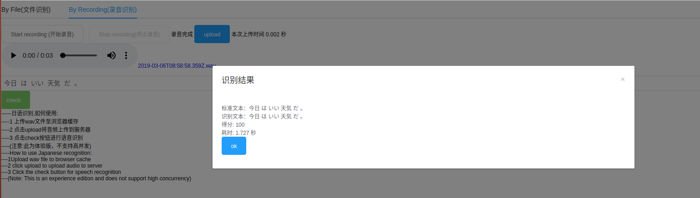

# jpasr
Web application for japanese speech recognition(日语语音识别web版本)

因为服务器资费昂贵，目前已关闭接口服务，需要的可以留言，可以教你部署。

提示：

1 由于是前后端分离的形式，所以使用前需要将以上两个地址都在浏览器中手动添加安全例外

2 由于recoder-js需要依赖于https协议，但我没有申请公网证书，所以需要手动同意。另外，建议使用谷歌浏览器，或者360浏览器的极速模式.

Tip:

1 Because recoder-js needs to rely on HTTPS protocol, but I did not apply for a public network certificate, so I need to agree manually. In addition, it is recommended to use Google Chrome Browser or the extreme speed mode of 360 browser.

2 Because it is a form of front-end and back-end separation, it is necessary to manually add security exceptions to both addresses in the browser before using them.

下面是演示图:

